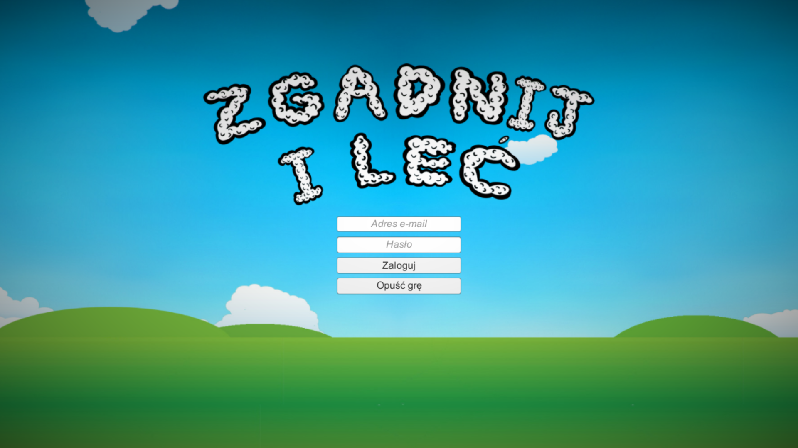
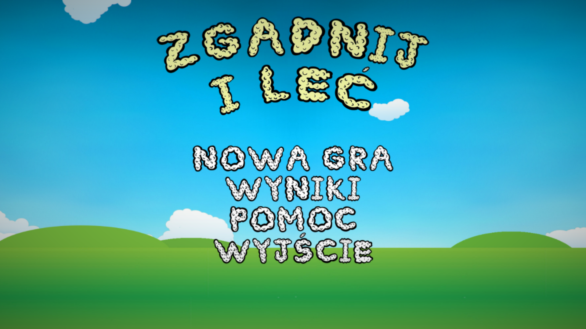
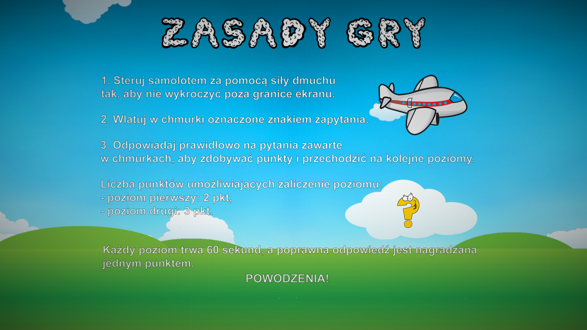
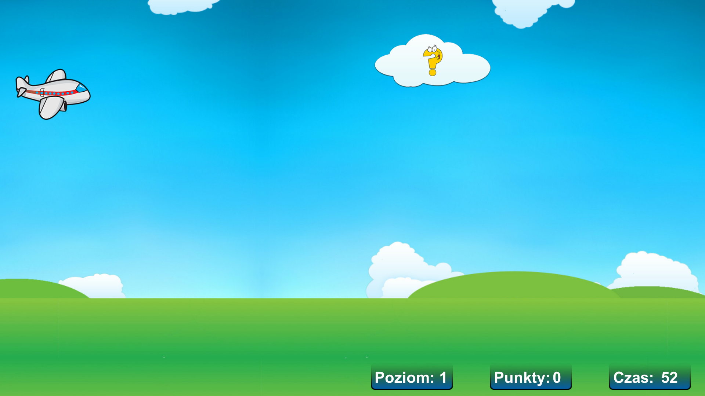
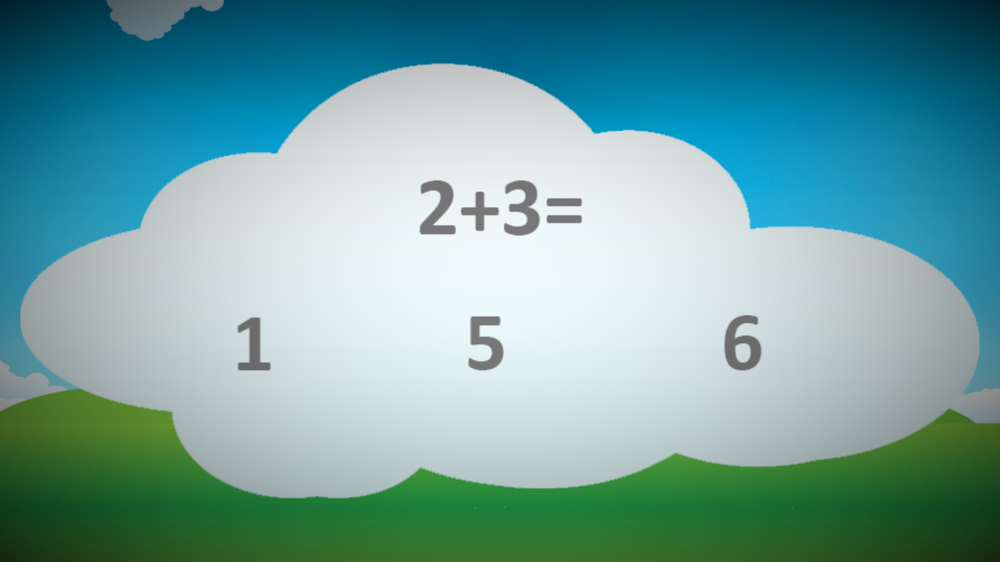
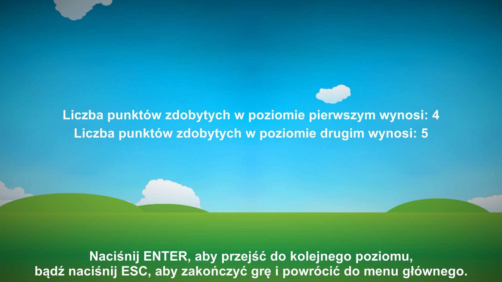
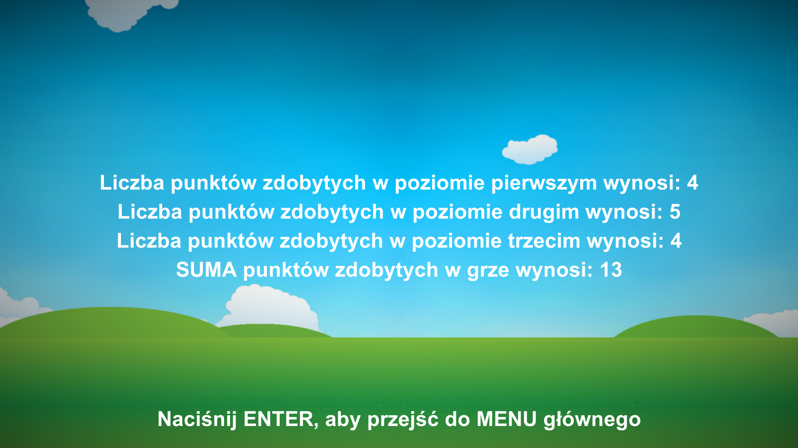
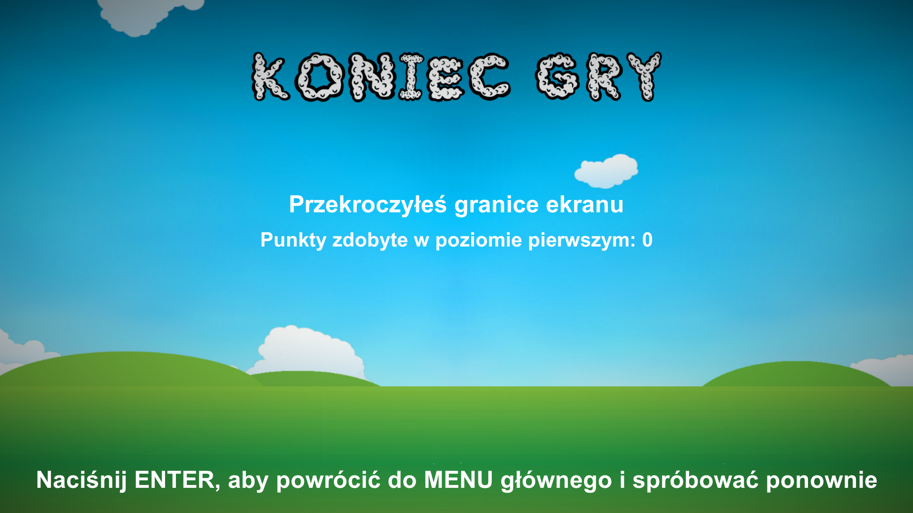
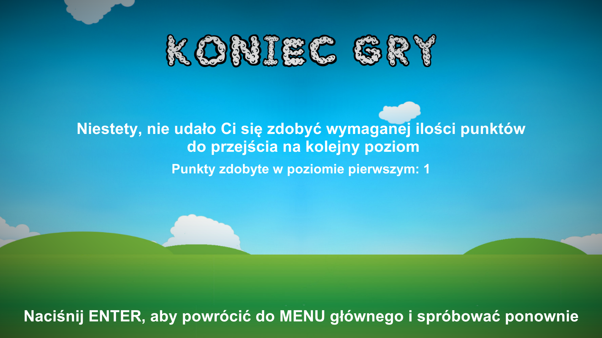
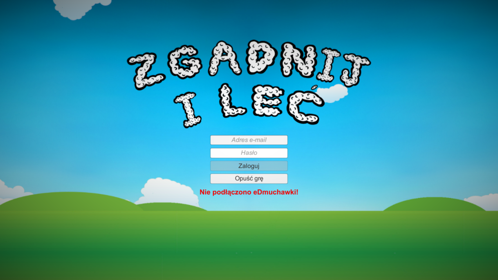

![Logo][logo-url]

# guess-and-fly-cs

![Language][language-url] ![License][license-url] ![Version][version-url] ![Done][done-url] ![Maintenance][maintenance-url]

### Fully compatible 2D game for [eBlow](http://www.domestic.gda.pl/?p=136&lang=en) made with [Unity](https://unity3d.com/)

#### This game is intended to help people (mostly children) in speech therapy. The user's task is to control the airplane by air pressure and answer questions. The game consists of three levels.

###### The game works with an internet system called [eDmuch](https://github.com/kawasilewska/speech-therapy) and a device called eDmuchawka. Both system and game are made by me. Upon completion of the game, the scores are saved in the database and displayed in the system as graphs. This enables therapists and parents to keep track of their pupils' progress.

###### The graphical interface of the games and music used are clear, intuitive and child friendly, as can be seen in the screenshots below.

## Screenshots
  
  
  
  

[logo-url]: Assets/Graphics/logocol.png "Logo"
[language-url]: https://img.shields.io/badge/language-C%23-lightgrey.svg?style=flat "Language"
[license-url]: https://img.shields.io/badge/license-Apache%202-blue.svg?style=flat "License"
[version-url]: https://img.shields.io/badge/version-1.0.0-brightgreen.svg?style=flat "Version"
[done-url]: https://img.shields.io/badge/done-01.2016-yellow.svg?style=flat "Done"
[maintenance-url]: https://img.shields.io/maintenance/no/2016.svg?style=flat "Maintenance"
